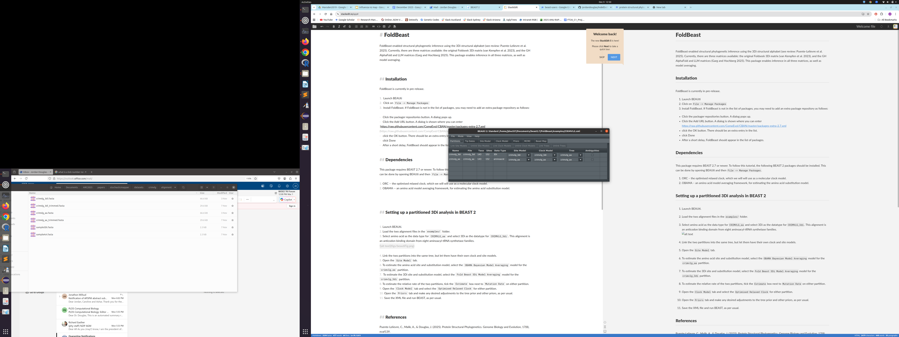
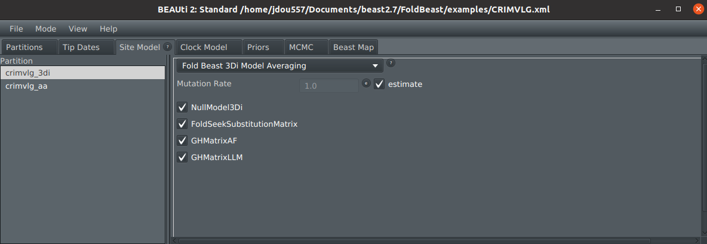

# FoldBeast

FoldBeast enables structural phylogenetic inference using the 3Di structural alphabet (see review: Puente-Lelievre et al. 2025). Currently, there are three matrices available: the original Foldseek 3Di matrix (van Kempfen et al. 2023), and the GH AlphaFold and LLM matrices (Garg and Hochberg 2025). This package enables inference in all three matrices, as well as model averaging.

## Installation

FoldBeast is currently in pre-release. 

1.  Launch BEAUti
2.  Click on `File -> Manage Packages`
3.  Install FoldBeast. If FoldBeast is not in the list of packages, you may need to add an extra package repository as follows:

-   Click the packager repositories button. A dialog pops up.
-   Click the Add URL button. A dialog is shown where you can enter  [https://raw.githubusercontent.com/CompEvol/CBAN/master/packages-extra-2.7.xml](https://raw.githubusercontent.com/CompEvol/CBAN/master/packages-extra-2.7.xml)
-   click the OK button. There should be an extra entry in the list.
-   click Done
-   After a short delay, FoldBeast should appear in the list of packages.

## Dependencies

This package requires BEAST 2.7 or newer. To follow this tutorial, the following BEAST 2 packages should be installed. This can be done by opening BEAUti and then `File -> Manage Packages`. 

1. ORC -- the optimised relaxed clock, which we will will use as a molecular clock model.
2. OBAMA -- an amino acid model averaging framework, for estimating the amino acid substitution model.

## Setting up a partitioned 3Di analysis in BEAST 2

In this tutorial, we will configure a BEAST 2 analysis from an amino acid and 3Di partition of the same dataset. Both partitions will share a phylogeny, however they will have their own site and clock models.

1. Launch BEAUti.
2. Load the two `fasta` alignment files in the `examples/` folder.
3. Select amino acid as the data type for `crimvlg_aa` and select 3Di as the datatype for `crimvlg_3di`. This alignment is an anticodon binding domain from eight aminoacyl-tRNA synthetase families.

4. Link the two partitions into the same tree, but let them have their own clock and site models.

5. Open the `Site Model` tab.
6. To estimate the amino acid site and substitution model, select the `OBAMA Bayesian Model Averaging` model for the `crimvlg_aa` partition.
7.  To estimate the 3Di site and substitution model, select the `Fold Beast 3Di Model Averaging` model for the `crimvlg_3di` partition. This will compare the four models described at the top of this page, plus a "null model" where all exchangeability rates are equal. If this model is chosen, there may be something wrong with the analysis, for example amino acids may have been uploaded instead of 3Di characters.
8. To estimate the relative rate of the two partitions, tick the `Estimate` box next to `Mutation Rate` on either partition.

9. Open the `Clock Model` tab and select the `Optimised Relaxed Clock` for either partition.
10. Open the `Priors` tab and make any desired adjustments to the tree prior and other priors, as per usual.
11. Save the XML file and run BEAST 2, as per usual.

## References

Puente-Lelievre, C., Malik, A., & Douglas, J. (2025). Protein Structural Phylogenetics. Genome Biology and Evolution, 17(8), evaf139.

van Kempen, Michel, et al. "Fast and accurate protein structure search with Foldseek." Nature Biotechnology (2023): 1-4.

Garg, S. G., & Hochberg, G. K. (2025). A general substitution matrix for structural phylogenetics. Molecular Biology and Evolution, 42(6), msaf124.

## Support

Beast user forums https://groups.google.com/g/beast-users

Or email Jordan Douglas: jordan.douglas@auckland.ac.nz
